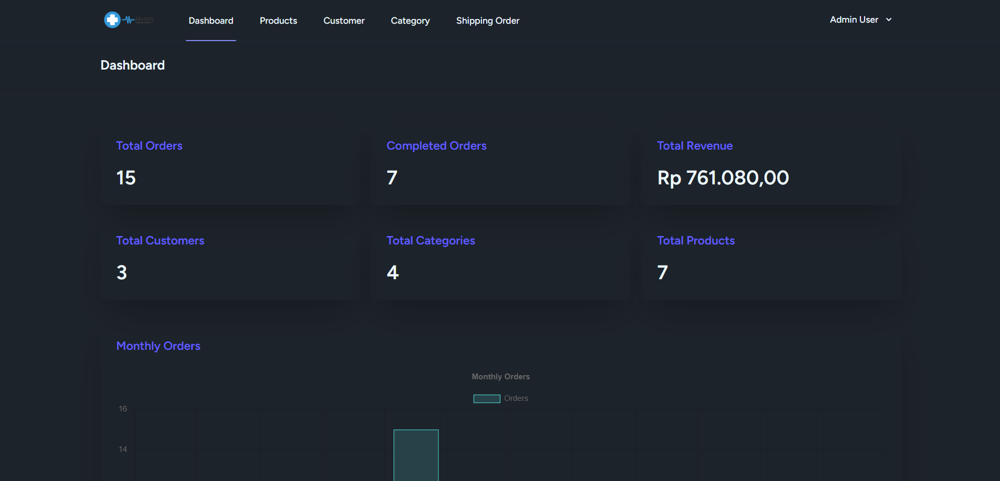

# Medify - Medical E-commerce Platform


## 📋 Overview

Medify is a modern e-commerce platform specialized in medical and pharmaceutical products. Built with Laravel, React, and Inertia.js, it offers a seamless shopping experience for medical products with secure payment integration.

## 🌟 Features

### Customer Features

- **Product Browsing & Search**

  - Browse products by categories
  - Search functionality
  - Product filtering
  - Detailed product views

- **Shopping Cart**

  - Add/remove products
  - Adjust quantities
  - Real-time price calculations
  - Tax calculations

- **Order Management**
  - Order tracking
  - Order history
  - Payment status monitoring
  - Shipping status updates

### Admin Features

- **Dashboard Analytics**

  - Total orders overview
  - Revenue tracking
  - Monthly order statistics
  - Customer metrics

- **Product Management**

  - Add/Edit/Delete products
  - Image upload
  - Category management
  - Price management

- **Order Processing**

  - Order status updates
  - Payment verification
  - Shipping management
  - Order history

- **Customer Management**
  - Customer list
  - Customer details
  - Role management

## 💻 Technical Architecture

### Database Schema


### Technology Stack

- **Backend**: Laravel 12.9.2
- **Frontend**: React + Inertia.js
- **Database**: MySQL
- **Payment Gateway**: Midtrans
- **Styling**: Tailwind CSS + DaisyUI
- **Authentication**: Laravel Breeze

## 🚀 Installation

```bash
# Clone the repository
git clone https://github.com/diasoy/medify.git

# Install PHP dependencies
composer install

# Install Node dependencies
npm install

# Copy environment file
cp .env.example .env

# Generate application key
php artisan key:generate

# Run migrations
php artisan migrate

# Seed the database
php artisan db:seed

# Start the development server
php artisan serve

# Start Vite development server
npm run dev
```

## 🔧 Configuration

### Environment Variables

```env
DB_CONNECTION=mysql
DB_HOST=127.0.0.1
DB_PORT=3306
DB_DATABASE=medify
DB_USERNAME=root
DB_PASSWORD=

MIDTRANS_SERVER_KEY=your_server_key
MIDTRANS_CLIENT_KEY=your_client_key
MIDTRANS_IS_PRODUCTION=false
MIDTRANS_IS_SANITIZED=true
MIDTRANS_IS_3DS=true
```

## 👥 User Roles

### Admin

- Full access to dashboard
- Product management
- Order management
- Customer management
- Category management

### Customer

- Browse products
- Manage shopping cart
- Place orders
- Track order status
- View order history

## 📱 Screenshots

### Customer Interface

#### Products Page


#### Shopping Cart


#### Order History


### Admin Interface

#### Dashboard



#### Product Management


#### Category Management


#### Customer Management


#### Order Management


## 🔐 Security Features

- CSRF Protection
- XSS Prevention
- SQL Injection Protection
- Input Validation
- Secure File Upload
- Role-based Access Control

## 🛠️ Development Tools

- VS Code
- Laravel Debugbar
- React Developer Tools
- MySQL Workbench
- Git

## 🤝 Contributing

Contributions, issues, and feature requests are welcome! Feel free to check.
